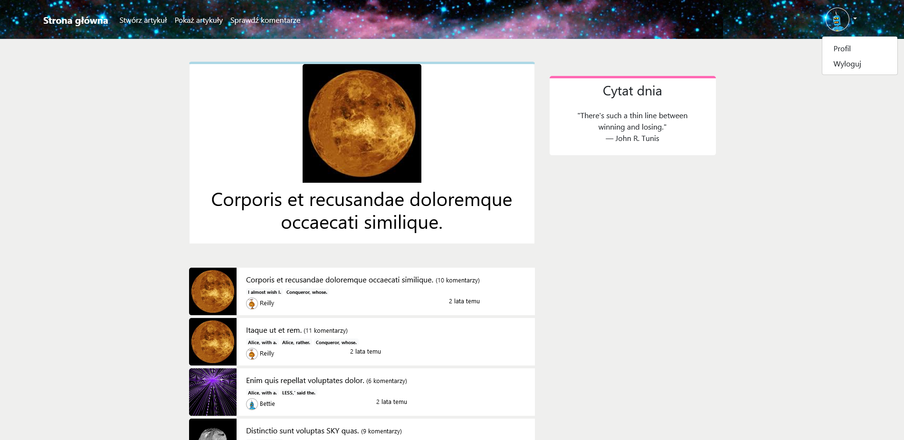
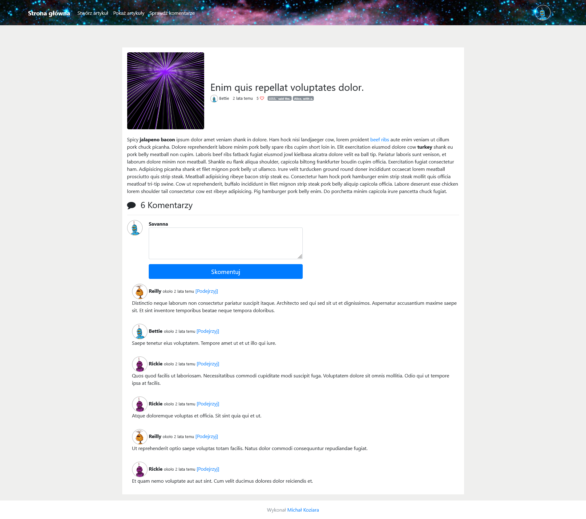
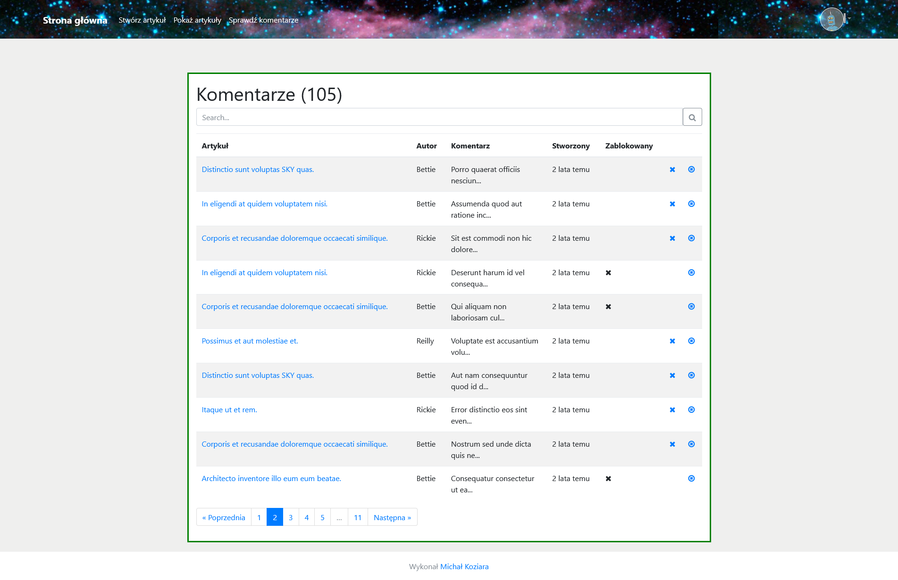
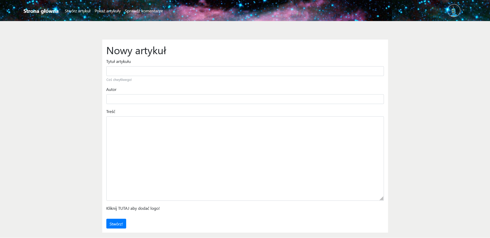
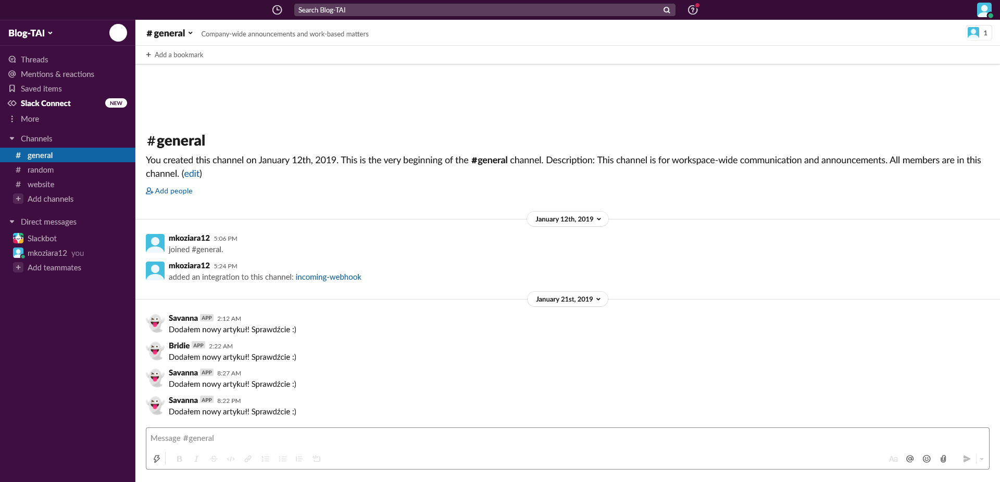
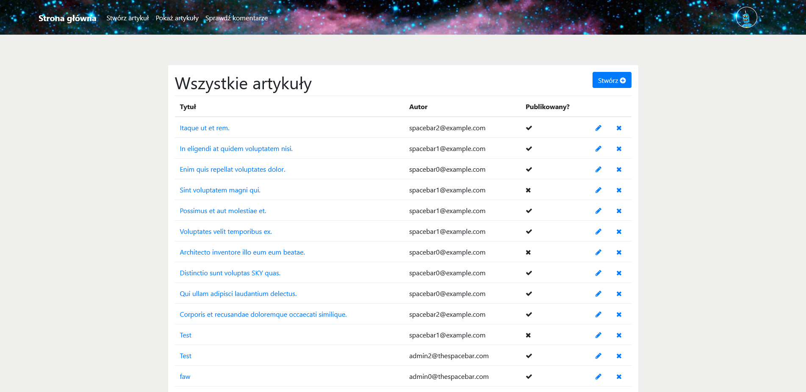

# Symfony Blog
### Web page for publishing articles

The goal of this project is to create a web page that allows users to post and manage their articles.

## Getting Started

These instructions will get you a copy of the project up and running on 
your local machine for development and testing purposes.

### Prerequisites

* PHP [7.1.3+] - https://www.php.net/
* Composer - https://getcomposer.org/
* APCu [on Windows] - [Detailed Instructions](https://stackoverflow.com/questions/24448261/how-to-install-apcu-in-windows)

Detailed information about installation and configurations are provided at developers' site.

For dockerization of this project see my [Symfony-blog-docker](https://github.com/michalkoziara/Symfony-blog-docker) repository.

## Technology Stack

* Symfony [4.2]
* PHP [7]
* MySQL for local development and testing
* Heroku + PostgreSQL for the production environment

### Setup 

A step by step instruction [on Windows]:
* Navigate to project directory.
* Run the following commands:

    ``composer install``
    
    ``php bin\console server:run``

The application should be ready to build and run locally now.

The default database is MySQL with the following address:
``mysql://root:@127.0.0.1:3306/app``

In order to change the database, ``.env`` and ``config/packages/doctrine.yaml`` files should be modified accordingly.

## Preview

<table>
    <tr>
        <td>
            
Homepage

            
        </td>
        <td>
            
Article

            
        </td>
    </tr>
    <tr>
        <td>
            
Article Administration Panel

            
        </td>
        <td>
            
Creating Article

            
        </td>
    </tr>
    <tr>
        <td>
            
Slack Integration

            
When an article is published, a message is sent to Slack.

            
        </td>
        <td>
            
Comment Administration Panel

            
        </td>
    </tr>
</table>

## Author

* **Michał Koziara** 
